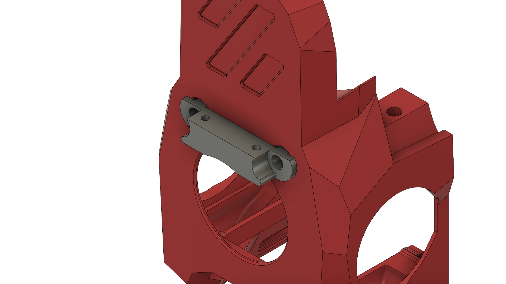

# Mini-StealthBurner ADXL front mount
A front mountable ADXL mount for generic ADXL-PCBs.

Secure the PCB with 2 M2 Self-tapping screws to the printed part.
To attach it to the MiniSB replace the 2 M3x35 BHCS screws in the front and install the printed part with 2 M3x40 Screws.

## Caution
This construction will collide with the front door and is only intended to be installed while doing resonance testing and not while general printing.

## BOM
| Part | Quantity |
| ---- | -------- |
| M3x40 BHCS/SHCS | 2 |
| M2x10 Self-Tapping Screw | 2 | 