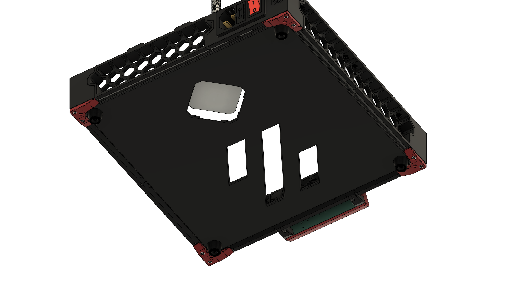

# V0.2 Printed Bottom Panel
A drop-in-replacement bottom panel for the V0.2.
It includes a cutout and indentation to properly give space for 34mm tall z-motors and a Voron-Logo Cutout for air-flow to the PSU. Requires a larger printer to print.

## Printing-Instructions
You don't need to print with the default Voron-Settings, 15% infill and 2 perimeters are enough, so save some filament.

If you don't want the bed-texture to show to the bottom of your V0.2 flip the part in your slicer.

Due to shrinkage and tolerance stack you might have issues lining up all screw-holes at the same time, so you might need to drill out the holes to give you more wiggle room.